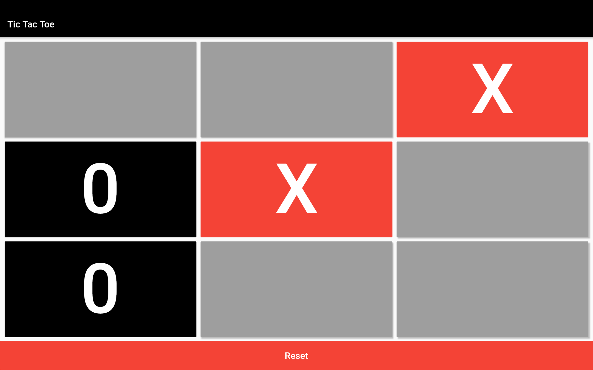

# Flutter Tic Tac Toe for Temi

A Flutter Tic Tac Toe project adapted to Temi Robot.

## Screenshots

|                        Tic Tac Toe                        |
| --------------------------------------------------------- |
||

## Original creator

[Pawan Kumar](https://github.com/iampawan) ([@imthepk](https://www.twitter.com/imthepk)) ([Youtube](https://www.youtube.com/c/MTechViral))
([Insta](https://www.instagram.com/codepur_ka_superhero))

> If you found this project helpful or you learned something from the source code and want to thank me, consider buying me a cup of :coffee:
>
> * [PayPal](https://www.paypal.me/imthepk/)

## Icon made by

[Pixel perfect](https://www.flaticon.com/authors/pixel-perfect) from [www.flaticon.com](http://www.flaticon.com/).

## Getting Started

This project is a starting point for a Flutter application.

A few resources to get you started if this is your first Flutter project:

- [Lab: Write your first Flutter app](https://flutter.dev/docs/get-started/codelab)
- [Cookbook: Useful Flutter samples](https://flutter.dev/docs/cookbook)

For help getting started with Flutter, view our
[online documentation](https://flutter.dev/docs), which offers tutorials,
samples, guidance on mobile development, and a full API reference.
